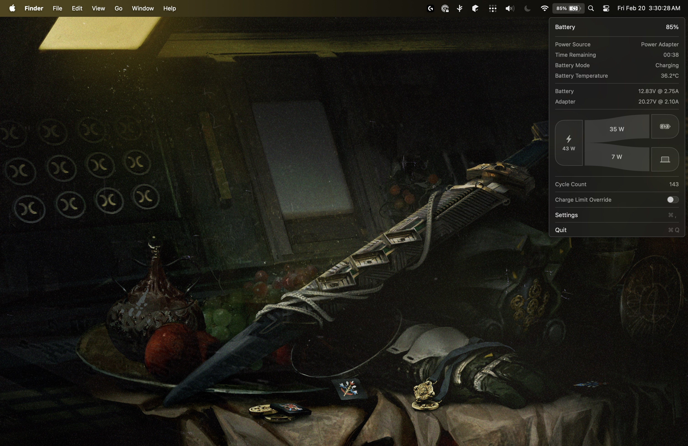

# Stasis

> ***A fork of [DinanathDash/Stasis](https://github.com/DinanathDash/Stasis), itself a fork of [srimanachanta/Stasis](https://github.com/srimanachanta/Stasis), with charge control that works on macOS 27.***

**A smarter battery icon for your MacBook.** Monitor power metrics, manage charge limits, top up on demand, and extend your battery's lifespan from the menu bar.

macOS 27 removed the SMC charge controls that Stasis and similar apps relied on. This fork drives the charge limit through Apple's own PowerUI charge-limit client instead, so "limit at 80%, top up when I need to" works again.

> **Apple Silicon only.** Requires **macOS 14.8 – 27.0**.



---

## What this fork adds

- **Top Up on macOS 27** (Charge Limit Override): temporarily lifts the firmware limit with Apple's `temporarilyDisableMCL`, then puts the limit back on cancel, unplug, a 12 hour cap, or helper restart.
- **Top Up on Next Plug-in:** while unplugged, ask for the limit to be bypassed the next time you plug in. It starts a couple of seconds after the adapter is detected.
- **Force Discharge on macOS 27:** switch the adapter off while plugged in, so the Mac runs from the battery.
- **Charge limit slider in the menu bar dropdown**, snapping to the firmware steps on macOS 27 (80, 85, 90, 95, 100%).
- **Charge bar with a limit marker** under the battery percentage.
- **Low Power Mode toggle** in the dropdown. The one-time helper approval covers it, so there is no admin prompt each time.
- **Reorderable, hideable menu sections and rows** (Settings → Dashboard).
- **Idle power source hidden** in the power-flow diagram.
- **Toggles reset on unplug:** Top Up, Top-up to Limit and Pause no longer look active after you unplug.
- **Hardened helper:** the helper checks each XPC connection against the app's own signature, and the app verifies the helper actually answers after an upgrade.

See [CHANGELOG.md](CHANGELOG.md) for each version.

## What macOS 27 can and can't do

| Feature | macOS 14.8 – 26 | macOS 27 |
| :--- | :--- | :--- |
| Charge limit | 50–100%, any value | 80, 85, 90, 95, 100% only |
| Top Up / Charge Limit Override | Yes | Yes |
| Top Up on Next Plug-in | Yes | Yes |
| Force Discharge (adapter off) | Yes | Yes |
| Pause Charging at the current level | Yes | **No.** The firmware only holds at the fixed steps. A limit above the level keeps charging, one below it runs the Mac from the battery. |
| Sailing Mode, Automatic Discharge, Calibration | Yes | Limited by the same fixed steps |
| Heat Protection | Yes | Yes |

These limits come from the private Apple API, not from this app.

---

## Highlights

- **Hardware Charge Limit** enforced by the firmware, so it stays active through sleep and power cycles.
- **Sailing Mode** *(macOS 14–26 only)*: let the battery float inside a range instead of micro-charging.
- **Automatic Discharge** *(macOS 14–26 only)*: drain down to your limit while plugged in.
- **Heat Protection:** pause charging above a temperature you choose.
- **Apple Shortcuts & Siri:** App Intents plus a `stasis://` URL scheme.
- **Apps Using Significant Energy**, **Battery Calibration**, **Notch HUD**, **MagSafe LED control**, **multi-port and accessory detection**, a **live power dashboard**, a **power-flow diagram**, and **17 languages**.
- **Helper daemon management:** inspect, reinstall or remove the privileged helper from Settings.

---

## Installation

This fork is **not signed with an Apple Developer ID or notarized**, so macOS Gatekeeper will block it until you clear the quarantine flag. The app and its helper are ad-hoc signed; the helper only accepts connections from the exact build it shipped with.

1. Download `Stasis.dmg` from this repository's [Releases](https://github.com/DanielMoussa07/stasis/releases). The repository is private, so use the GitHub CLI if the browser asks you to sign in:
   ```bash
   gh release download --repo DanielMoussa07/stasis --pattern 'Stasis.dmg'
   ```
2. Open the DMG and drag **Stasis** into `/Applications`.
3. Clear the quarantine flag:
   ```bash
   xattr -cr /Applications/Stasis.app
   ```
4. Launch Stasis. When macOS shows "Background Items Added", open **System Settings → General → Login Items & Extensions** and turn Stasis on under *Allow in the Background*. That one approval installs the helper and also covers Low Power Mode.

### If the helper won't start

After an update the helper can sit in a stuck state. Quit Stasis, then:
```bash
defaults write com.dinanathdash.stasis storedAppVersion -string 0.0.0
```
Reopen Stasis. If it still fails, switch Stasis off and on again in Login Items, or use **Settings → General** to reinstall the helper.

### Updates

The in-app updater points at this repository and only offers builds signed for this fork. Until a signed update feed exists, install new versions from Releases.

### Uninstall

Remove the helper from **Settings → General**, quit the app, and delete `/Applications/Stasis.app`.

---

## Key Features & Automations

### 1. Apple Shortcuts & Siri Integration
Stasis registers native App Intents and Siri Shortcuts (Note: Features marked with * are disabled on macOS 27 due to OS restrictions):
- **`Get Battery Status`**: Retrieve real-time battery percentage, charging state, wattage, voltage, amperage, temperature, and health metrics.
- **`Set Charge Limit`**: Programmatically change the hardware charge limit (50%–100%).
- **`Toggle Top-Up to 100%`**: Enable or disable Charge Limit Override to temporarily charge to 100%.
- **`Toggle Sailing Mode`** & **`Set Sailing Mode Limit`**: Enable/disable Sailing Mode and set float thresholds.
- **`Toggle Force Discharge`**: Run your MacBook on battery power while plugged in.
- **`Start / Cancel Battery Calibration`**: Initiate or stop an automated calibration cycle.
- **`Toggle Heat Protection`** & **`Set Heat Protection Temperature`**: Manage thermal limits.
- **`Open Dashboard`**: Open the menu bar dropdown or Settings window programmatically.

### 2. Apps Using Significant Energy
Stasis monitors running macOS applications in real-time to identify high-energy consumers:
- Displayed directly in the menu bar popover dashboard for immediate visibility.
- Toggleable in **Settings → Dashboard → Status** (`Apps using significant energy`).

### 3. Battery Calibration Service
Over time, battery gauge readings can drift. Stasis includes an interactive Battery Calibration Service:
- Guided cycle: **Discharge to 15% → Recharge to 100% → Rest at 100%**.
- Interactive system notifications guide you when to plug in or disconnect power.
- Managed from **Settings → Calibration**.

### 4. Dynamic Island Notch HUD
For MacBooks with a hardware camera notch (or simulated notch):
- Displays elegant, animated status pills for charging state changes, charge limit notifications, and power alerts.
- Uses `TopWindowElevator` to ensure notifications remain visible above full-screen apps, menu bars, and lock screens.

### 5. Multi-Port Detection & Precision Power
- Identifies connected power accessories (MagSafe 3, USB-C Power Delivery, USB Hubs, and external displays) with custom iconography.
- Enable **Two-Decimal Power Precision** in **Settings → Dashboard** for 0.01W / 0.01A accuracy.

### 6. Helper Daemon Management
- Stasis uses a lightweight privileged helper daemon (`com.dinanathdash.stasis.charging-helper`) to communicate securely with the Apple Silicon SMC.
- Inspect daemon status, reinstall, or uninstall the daemon directly from **Settings → General**.

---

## Automation, Shortcuts & CLI (`stasis://`)

Stasis supports universal automation via custom URL schemes (`stasis://...`) and shell commands. This allows reliable integration with **Apple Shortcuts** (via the built-in **Open URL** action), **Terminal scripts**, **Raycast**, and **Alfred**—working across all builds (including GitHub releases) without requiring an Apple Developer Account.

For step-by-step Apple Shortcuts setup, CLI examples, and the full command table (`stasis://charge-limit?value=80`, `stasis://topup`, `stasis://sailing`, etc.), see the **[Stasis Automation & Apple Shortcuts Guide](SHORTCUTS_AND_AUTOMATION.md)** or check the in-app **Settings → Shortcuts & Help** tab.

---

## Documentation & Wiki

See **[SHORTCUTS_AND_AUTOMATION.md](SHORTCUTS_AND_AUTOMATION.md)** for automation, and the [upstream wiki](https://github.com/DinanathDash/Stasis/wiki) for general guides (it describes the upstream build).

---

## Building from Source

```bash
git clone https://github.com/DanielMoussa07/stasis.git
cd stasis
open stasis.xcodeproj
```

- Requires macOS 15.7+ and Xcode with Swift 6+ support.
- Dependencies resolve automatically via Swift Package Manager.
- To test local builds with automatic replacement of `/Applications/Stasis.app`, use our developer build script:
  ```bash
  ./build_and_install.sh
  ```

---

## Contributing

PRs are welcome! Please review our **[Contributing Guide](CONTRIBUTING.md)** and open an issue first for large changes or feature discussions.

---

## Acknowledgments

This fork combines work from several Stasis forks. All are GPL-3.0.

- [DinanathDash/Stasis](https://github.com/DinanathDash/Stasis): the base this fork builds on, including the macOS 27 native charge-limit backend.
- [avcolgate/Stasis](https://github.com/avcolgate/Stasis): the charge bar with a charge-limit marker.
- [Xu-Zhangsheng/Stasis](https://github.com/Xu-Zhangsheng/Stasis): the idea of a customizable, reorderable menu dashboard and a charge-limit slider in the menu.
- [srimanachanta/Stasis](https://github.com/srimanachanta/Stasis): the original project.

Added here: Top Up on macOS 27 through Apple's `temporarilyDisableMCL` API, the menu charge-limit slider for macOS 27's 80-100% range, and hiding the idle adapter in the power-flow diagram.


- [SMCKit](https://github.com/srimanachanta/SMCKit) — SMC access library
- [AsahiLinux](https://asahilinux.org/) — SMC key reverse engineering
- [Battery-Toolkit](https://github.com/mhaeuser/Battery-Toolkit) — SMC key documentation
- [Sparkle](https://sparkle-project.org/) — Secure and reliable software updates
- [Defaults](https://github.com/sindresorhus/Defaults) — Strongly-typed UserDefaults

---

## License

[GPL-3.0](LICENSE)
